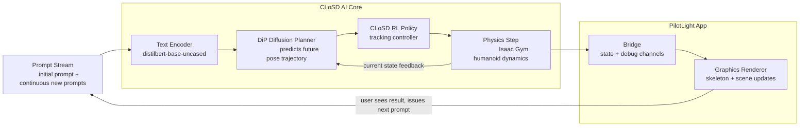

# mixed-motion

Under heavy development


## Launch

```bash
# Build viewer (once)
cd pilotlight_integration/pilotlight_app
./build_bridge_viewer.sh
```

```bash
conda activate closd
cd pilotlight_integration
./launch_closd_pilotlight.sh
# optional: --build-viewer  --debug-hml  --keep-viewer
```

## From scratch

### 1. Prerequisites (Ubuntu/Linux)

Install system packages used by Isaac Gym + PilotLight build:

```bash
sudo apt update
sudo apt install -y \
        build-essential clang cmake ninja-build pkg-config \
        libx11-dev libxrandr-dev libxi-dev libxinerama-dev libxcursor-dev \
        libgl1-mesa-dev libvulkan-dev glslang-tools
```

Install Miniconda/Conda if not already installed.

### 2. Repository layout

This project expects these folders at the root level:

- CLoSD
- isaacgym
- pilotlight_integration

### 3. Create and populate the Python environment

```bash
conda create -n closd python=3.8 -y
conda activate closd

# CLoSD python deps
pip install -r CLoSD/requirement.txt

# Isaac Gym python package
pip install -e isaacgym/python
```

### 4. Prepare scripts

```bash
chmod +x pilotlight_integration/pilotlight_app/build_bridge_viewer.sh
chmod +x pilotlight_integration/pilotlight_app/run_bridge_viewer.sh
chmod +x pilotlight_integration/launch_closd_pilotlight.sh
chmod +x pilotlight_integration/sync_closd_overlay.sh
```

### 5. Build the PilotLight bridge viewer

```bash
cd pilotlight_integration/pilotlight_app
./build_bridge_viewer.sh
```

### 6. Run end-to-end

```bash
conda activate closd
cd pilotlight_integration
./launch_closd_pilotlight.sh
# optional: --build-viewer --debug-hml --keep-viewer
```

### 7. Where to place custom edits

External repos are treated as dependencies. Keep your editable sources here:

- PilotLight app bridge source: pilotlight_integration/pilotlight_app/src/app_bridge.c
- CLoSD overlay files: pilotlight_integration/closd_overlay/...

The launcher runs pilotlight_integration/sync_closd_overlay.sh before starting CLoSD, so overlay files are copied into CLoSD automatically.


## Models


| Model | Path | Role |
|---|---|---|
| DiP diffusion planner (text-to-motion, no target) | [model000200000.pt](CLoSD/closd/diffusion_planner/save/DiP_no-target_10steps_context20_predict40/model000200000.pt) | Predicts future motion from text prompt, 10 DDIM steps, 20 context / 40 predicted frames |
| CLoSD RL policy | [Humanoid.pth](CLoSD/output/CLoSD/CLoSD_t2m_finetune/Humanoid.pth) | AMP-based physics RL controller that drives the humanoid to track DiP predictions |
| SMPL body model | [SMPL_NEUTRAL.pkl](CLoSD/closd/diffusion_planner/body_models/smpl/SMPL_NEUTRAL.pkl) | Body shape / joint regression used by both systems |
| BERT text encoder | `distilbert-base-uncased` via HuggingFace cache (`~/.cache/huggingface/`) | Encodes the text prompt into an embedding that conditions DiP |


## AI DSP

The runtime behaves like a continuous AI DSP loop: prompts are streamed in, transformed into motion plans, stabilized by physics control, and rendered by the PilotLight viewer while new prompts keep updating intent.



