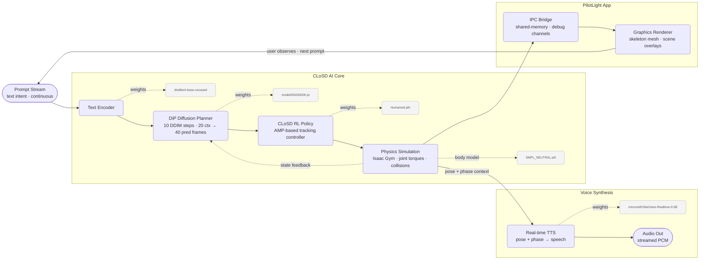

# mixed-motion

Under heavy development


## Launch

```bash
# Build viewer (once)
cd pilotlight_integration/pilotlight_app
./build_bridge_viewer.sh
```

```bash
conda activate closd
cd pilotlight_integration
./launch_closd_pilotlight.sh
# optional: --build-viewer  --debug-hml  --keep-viewer
```

## From scratch

### 1. Prerequisites (Ubuntu/Linux)

Install system packages used by Isaac Gym + PilotLight build:

```bash
sudo apt update
sudo apt install -y \
        build-essential clang cmake ninja-build pkg-config \
        libx11-dev libxrandr-dev libxi-dev libxinerama-dev libxcursor-dev \
        libgl1-mesa-dev libvulkan-dev glslang-tools
```

Install Miniconda/Conda if not already installed.

### 2. Repository layout

This project expects these folders at the root level:

- CLoSD
- isaacgym
- pilotlight_integration


## Install

Two environments are required because IsaacGym ships pre-compiled binaries **only for Python 3.6–3.8**, while VibeVoice requires **Python ≥ 3.10**. They cannot share one interpreter.

| Environment | Python | Purpose |
|---|---|---|
| `conda closd` | **3.8** | IsaacGym · CLoSD · DiP · RL policy · SMPL · BERT |
| `.venv` | **3.10+** | VibeVoice audio worker (separate process) |

The launch script starts both automatically. Only `closd` needs to be active when you run it.

### 1. Create the conda environment (Python 3.8 — sim + all models)

```bash
conda env create -f environment.yml   # creates env named "closd"
conda activate closd
```

Then install the three packages that require local source or CUDA headers:

```bash
# IsaacGym — download the .tar.gz from https://developer.nvidia.com/isaac-gym,
# extract it, then install the bundled wheel:
pip install isaacgym/python/

# If launch later fails with missing gymtorch.cpp, link IsaacGym sources:
ln -sfn "$PWD/isaacgym/python/isaacgym/_bindings/src" \
        "$CONDA_PREFIX/lib/python3.8/site-packages/isaacgym/_bindings/src"

# pytorch3d — build from source. Ensure nvcc matches torch CUDA (torch=cu121 here):
export CUDA_HOME=/usr/local/cuda-12
export PATH="$CUDA_HOME/bin:$PATH"
export LD_LIBRARY_PATH="$CUDA_HOME/lib64:${LD_LIBRARY_PATH:-}"
nvcc --version  # should report CUDA 12.x (not 11.x)
pip install "git+https://github.com/facebookresearch/pytorch3d.git@v0.7.9"

# CLIP:
pip install git+https://github.com/openai/CLIP.git
```

### 2. Create the audio venv (Python 3.10+ — VibeVoice only)

```bash
conda deactivate
python3.10 -m venv .venv
.venv/bin/pip install -r audio_runtime/requirements_worker.txt

# Optional — enables vibevoice's fast CUDA path (requires CUDA headers):
.venv/bin/pip install flash-attn --no-build-isolation
```

The launch script detects `.venv/bin/python` automatically. If the venv is absent, the system runs without audio and logs a skip message.


### 5. Build the PilotLight bridge viewer

```bash
cd pilotlight_integration/pilotlight_app
./build_bridge_viewer.sh
```

### 6. Run end-to-end

```bash
conda activate closd
cd pilotlight_integration
./launch_closd_pilotlight.sh
# optional: --build-viewer --debug-hml --keep-viewer
```

### 7. Where to place custom edits

External repos are treated as dependencies. Keep your editable sources here:

- PilotLight app bridge source: pilotlight_integration/pilotlight_app/src/app_bridge.c
- CLoSD overlay files: pilotlight_integration/closd_overlay/...

The launcher runs pilotlight_integration/sync_closd_overlay.sh before starting CLoSD, so overlay files are copied into CLoSD automatically.


## Models


| Model | Path | Role |
|---|---|---|
| DiP diffusion planner (text-to-motion, no target) | [model000200000.pt](CLoSD/closd/diffusion_planner/save/DiP_no-target_10steps_context20_predict40/model000200000.pt) | Predicts future motion from text prompt, 10 DDIM steps, 20 context / 40 predicted frames |
| CLoSD RL policy | [Humanoid.pth](CLoSD/output/CLoSD/CLoSD_t2m_finetune/Humanoid.pth) | AMP-based physics RL controller that drives the humanoid to track DiP predictions |
| SMPL body model | [SMPL_NEUTRAL.pkl](CLoSD/closd/diffusion_planner/body_models/smpl/SMPL_NEUTRAL.pkl) | Body shape / joint regression used by both systems |
| BERT text encoder | `distilbert-base-uncased` via HuggingFace cache (`~/.cache/huggingface/`) | Encodes the text prompt into an embedding that conditions DiP |


## AI DSP

### Global Architecture

The runtime behaves like a continuous AI DSP loop: prompts are streamed in, transformed into motion plans, stabilized by physics control, and rendered by the PilotLight viewer while new prompts keep updating intent.



### DiP Diffusion Planner

Lorem ipsum

### RL Humanoid

Lorem ipsum

### Audio Runtime 


VibeVoice-Realtime is a lightweight real‑time text-to-speech model supporting streaming text input and robust long-form speech generation. It can be used to build realtime TTS services, narrate live data streams, and let different LLMs start speaking from their very first tokens (plug in your preferred model) long before a full answer is generated. It produces initial audible speech in ~300 ms (hardware dependent).

https://huggingface.co/microsoft/VibeVoice-Realtime-0.5B

